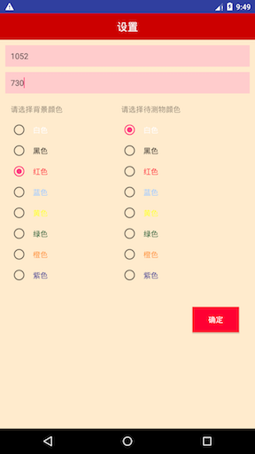
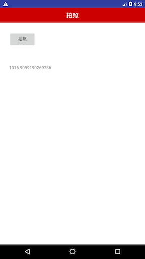
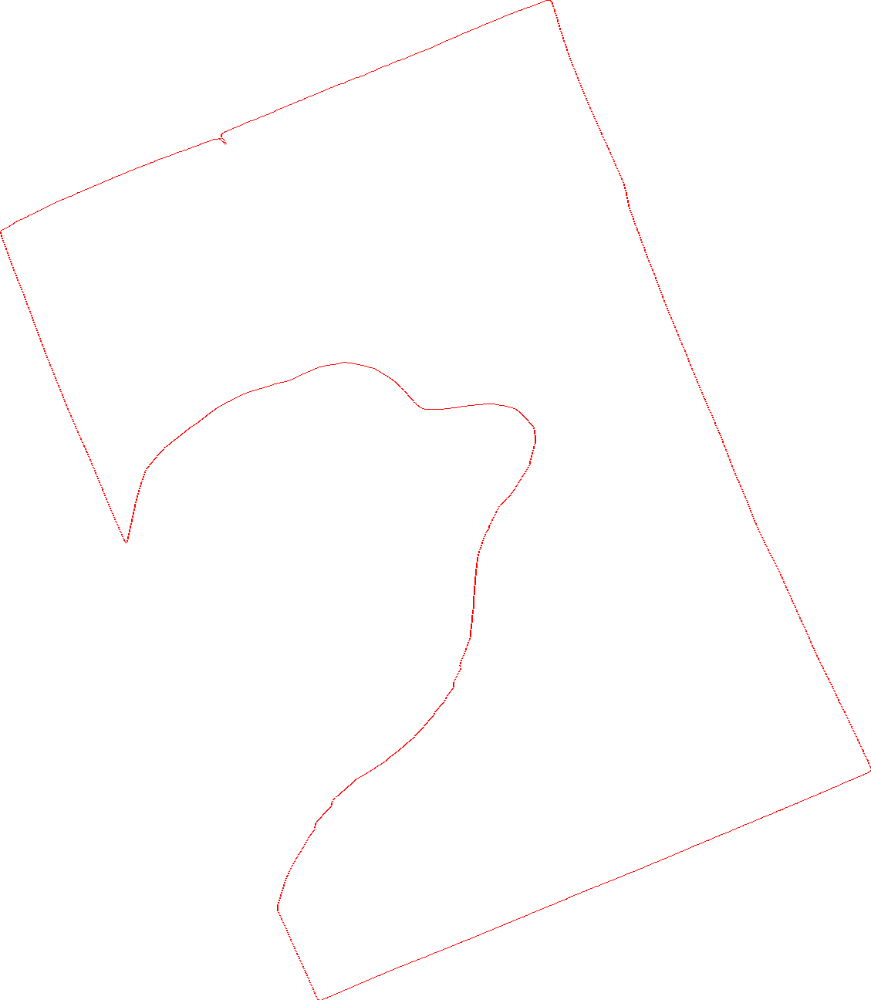

# 拍照计算边缘周长

## 1 简介

edgelen是一个通过图片识别出周长的工具，比如可以封装在APP中。



分别在输入框中输入背景的长与宽，选择背景的颜色，待测物的颜色，确定后



选择拍照，拍照确定后，会显示相应的长度。


edgelen是根据待测物在参考背景中的位置关系以及参考背景的尺寸（长宽），计算出待测物的周长。


## 2 实现思路

### 2.1  原始图像


原始图像查看：

[原始图像]: https://github.com/changhaili/edgelen/blob/master/images/naive.JPG

参考背景为一张红纸，本示例需要识别出三张白纸的周长。

红纸的长宽为：1052 * 730； 单位为毫米，手工软布尺测量，稍有误差。

最后识别出三张白纸的周长分别为：1015.7，519.2，1255.9 。 手工软布尺测量1015.5-， 518.5-，1254.5+，误差小于 0.2 %

也可进行如下精度推理：

1. 考虑到A4 大小标准为 297* 210， 即周长为 1014，误差小于0.2%。

2. 右侧两个图形是由一张A4纸剪出，则可以中间图形的周长推导出右侧图形的周长：

   中间白纸规则部分（即图形的左侧垂边，A4纸边）长度为139，则不规则部分为 519.2-139 = 380.2

   最右侧图形的周长可以计算出：1014 -139 + 380.2 = 1255.2 

   误差也小于 0.2%


当每两像素采样取点时，结果计算为1016.9， 519.2，1251.7，误差小于0.4%，运行速度得到了提升。


### 2.2 识别背景并建立坐标系统

#### 2.2.1 对背景设别

使用颜色判断，目前只支持  红，蓝，绿，黄，白等基本颜色。

这里背景为红纸，即红色


#### 2.2.2 对背景进行聚类

目前实现了层次聚类和密度聚类，目前密度聚类实现的速度和性能都优于层次聚类 ，但内存使用还有待优化。

聚类效果：

为了减少内存占用，背景只读取上下左右指定宽度的边框。

因为光照等原因，会有大量的错误象素，使得聚类会产生多个聚族，选择像素点最多的聚族为背景图像。实际情况中背景聚类拥有的象素点数量远远多于错误聚类的象素点。


#### 2.2.3 计算上下左右四角

1. 将聚类后的背景按顺时针旋转45度，并获取最外侧像素

   

2. 按上下左右四个点，将点划分为四个数组中，即四条边的点集合

3. 对每条边所有点进行一元线性回归，即拟合出 y = kx +b 的直线，操作如下：

   a. 对点进行排序，先x后y

   b. 删除头尾1/4（可调）的像素点，头尾像素点识别错误的可能性最大

   c. 对剩下的点进行一元线性回归

4. 解线性方法组，计算出四条直线的交点。这四个交点就是新的上下左右四个点

   

5. 将计算后四个点逆时针旋转45度，即原始点的坐标

#### 2.2.4 根据坐标点建立投影矩阵

1. 用户需要输入背景的真实长度和宽度

2. 目前没有考虑到透视情况。经过多次实验（从正上方，左上方，右上方等），当拍照角度不是特别倾斜的情况下，透视对最结果的影响极小。

3. 实际应用中只使用了三个点，取出 左上，右上，左下  三点

   ​

### 2.3 获取待测物边框

#### 2.3.1 对待测物进行识别

同背景识别一样，即对像素颜色进行判断。还需要判断像素点是否在背景区域内。

这里待测物为三张有规则或不规则白纸片，所以设置像素颜色为白色。

目前要求待测物的颜色是一样。


#### 2.3.2 聚类

同背景聚类一样，可以使用密度聚类或层次聚类。

考虑到图形的不规则性，聚类待测图片里，不能只取边缘像素。

聚类后的效果：


#### 2.3.3 识别边框

对每个聚类后图形进行Laplace滤波，识别图形的边框。

下图为对第三个图形识别出来的边框



#### 2.3.4 将图形边缘点生成多段线

### 2.4 计算边框长度

B样条插值


## 3 用到的一些算法

### 3.1 聚类

1. 层次聚类
2. 密度聚类

### 3.2 一元线性回归

### 3.3 多段线生成

### 3.4 滤波

高斯滤波

Laplace滤波

### 3.5 插值

B样条插值

### 3.6 矩阵计算

旋转

投影


## 4 示例代码


Maven配置了是使用Java 1.7，一些1.8的新特性还无法使用

以下代码在 GirthTest.java 文件中，可以指定一张新图片，运行该测试用用例


```java
// 运行时，下面四行赋值需要修改

String imgPath = "/Users/lichanghai/Mine/edgelen/images/naive.jpg";
    
SupportColor backColor = SupportColor.Red;
SupportColor foreColor = SupportColor.White;
int clusterCount = 3;

final BufferedImage img = ImageIO.read(new File(imgPath));

final int width = img.getWidth();
final int height = img.getHeight();

final int[] pixels = new int[width * height];
img.getRGB(0, 0, img.getWidth(), img.getHeight(), pixels, 0, width);

ImagePixelHolder pixelHolder = new ImagePixelHolder(1, new PixelImage() {

  @Override
  public int getWidth() {
    return width;
  }

  @Override
  public int getHeight() {
    return height;
  }

  @Override
  public int getColor(int x, int y) {
    return pixels[y * width+x];
  }
});

EdgeCurve[] curves  = LatticeUtils.getEdgeCurves(pixelHolder, 1052, 730,
                                                 backColor, foreColor, clusterCount, false);

for (EdgeCurve curve : curves) {

  GirthResult result = curve.getGirth();

  System.out.println("default : " + result.getRecommender());

  for (double d : result.getOthers()) {
    System.out.println("girth : " + d);
  }
}
```


## 5 一些问题

### 5.1 透视引起的精度问题

1. 目前没有考虑透视影响。为了实现方面，该项目本质是只是在平面上进行处理。透视需要考虑到三维空间的问题，比较麻烦。
2. 只要不是手机放得过于倾斜，透视带来的影响很小，几乎可以忽略。

### 5.2